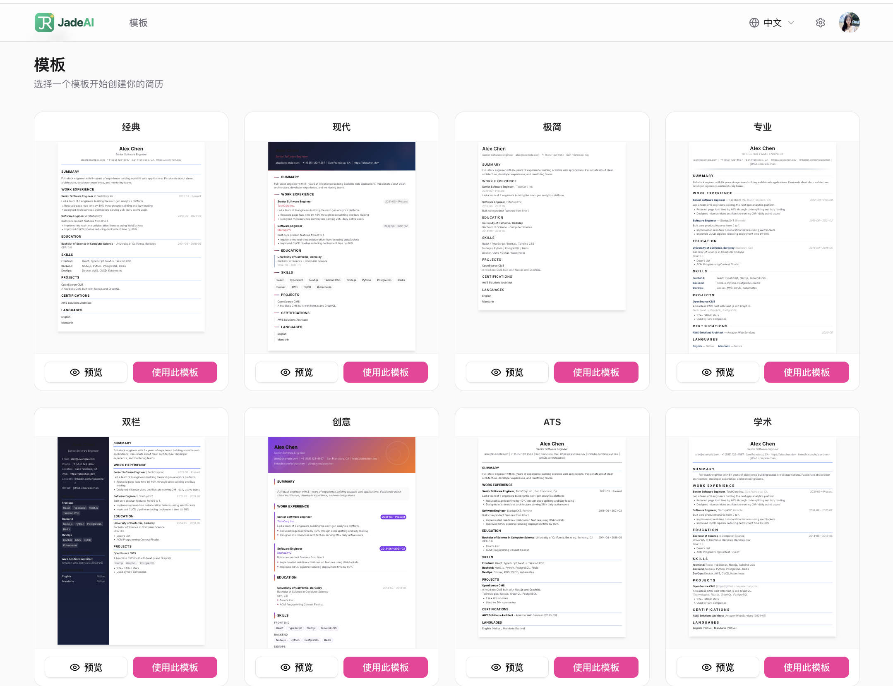
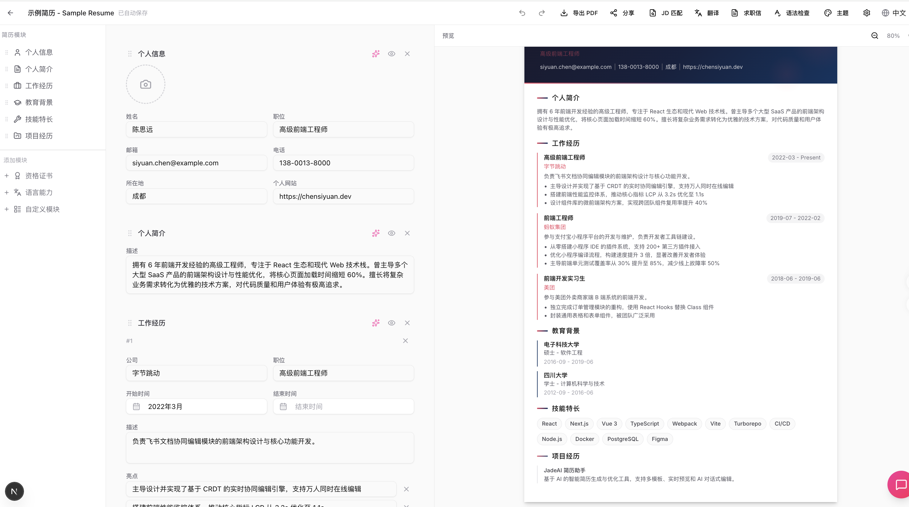
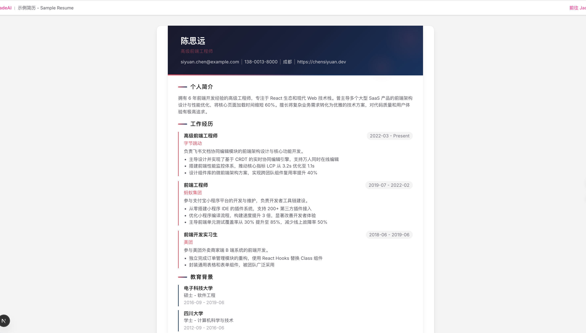

<div align="center">

# RoleRover

**Local-first AI resume workspace for Windows**

[](LICENSE)
[](https://tauri.app/)
[](https://react.dev/)
[](https://www.typescriptlang.org/)
[](./desktop)

[中文文档](./README.zh-CN.md)

</div>

RoleRover helps you write, tailor, and export resumes in a desktop app that keeps the main workflow close to your local machine. Install it, open your workspace, iterate with AI, and export polished resumes without setting up a server.

## Highlights

- Drag-and-drop resume editor with inline editing and autosave
- 50 resume templates with theme customization and export support
- AI-powered resume writing, resume parsing, JD matching, cover letter drafting, translation, and writing polish
- English and Chinese interface
- Local-first desktop experience with native import, export, window persistence, and in-app updates
- AI provider settings and secrets stay under the user's local control

## Screenshots

| Template Gallery | Resume Editor |
|:---:|:---:|
|  |  |

| AI Resume Generation | Shared Resume |
|:---:|:---:|
|  |  |

## Download

1. Open [GitHub Releases](https://github.com/lingshichat/RoleRover/releases).
2. Download the latest Windows installer, usually `.exe` or `.msi`.
3. Install RoleRover and launch it like a normal desktop app.

Current platform support:

- Windows is supported today
- macOS is planned next

## Why Desktop First

- No server setup is required for the main product workflow
- Resume editing, imports, exports, and update checks happen in a native desktop app
- Local configuration makes it easier to control AI providers and credentials yourself
- The product loop is optimized for a single-user workspace with less browser friction

## Build From Source

If you want to run RoleRover locally from source:

### Prerequisites

- Node.js 20+
- pnpm 9+
- For `pnpm run dev:tauri` or release builds on Windows: Rust stable and the Tauri 2 Windows toolchain

### Install

```bash
git clone https://github.com/lingshichat/RoleRover.git
cd RoleRover
pnpm install
```

### Run

```bash
pnpm run dev:tauri
```

This starts the desktop renderer and the native Tauri shell together.

## FAQ

<details>
<summary><b>Where are AI provider settings and keys stored?</b></summary>

In the supported desktop runtime, provider settings stay in the local client
workspace and secrets are designed to prefer OS keyring-backed storage when
available.

</details>

<details>
<summary><b>Why do some files or screenshots still mention JadeAI?</b></summary>

RoleRover is a maintained derivative of
[JadeAI](https://github.com/twwch/JadeAI). Some historical names remain in
older assets, shared code, or attribution files while the desktop product
continues to evolve under the RoleRover name.

</details>

## License And Attribution

RoleRover is distributed under the [Apache License 2.0](./LICENSE).

This repository is a derivative work based on JadeAI. When redistributing or
extending this project, keep the license text, upstream attribution, and the
derivative-work notice in [NOTICE](./NOTICE).
