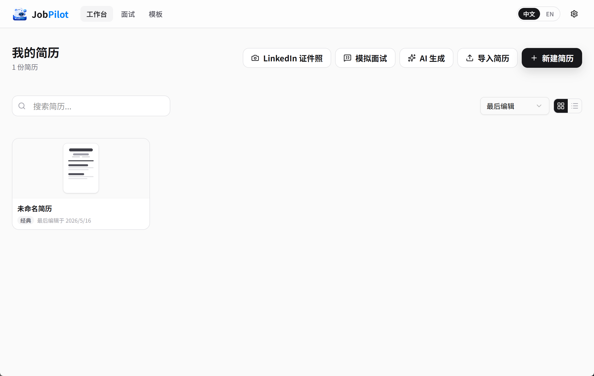
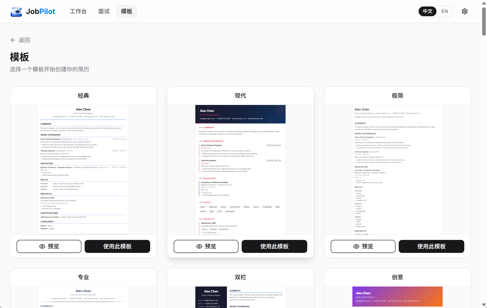
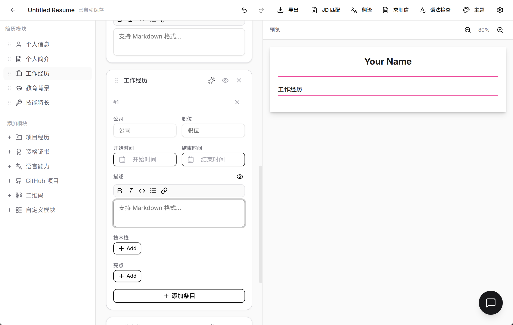
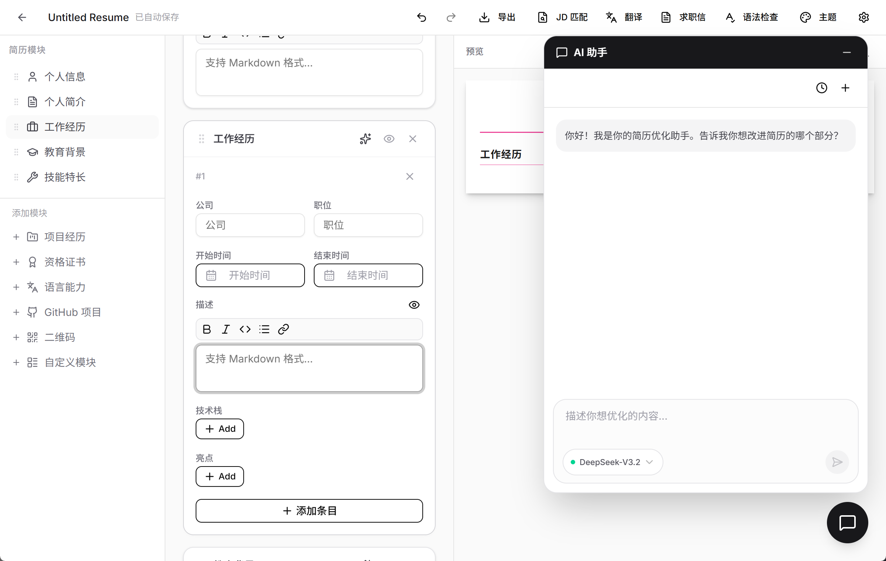
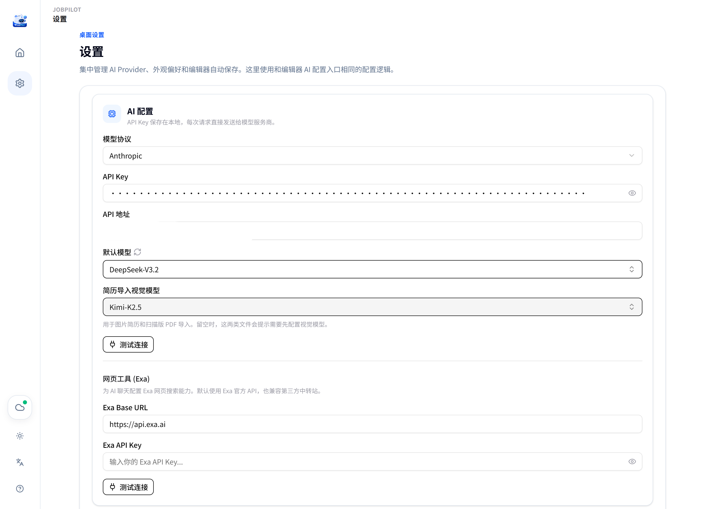
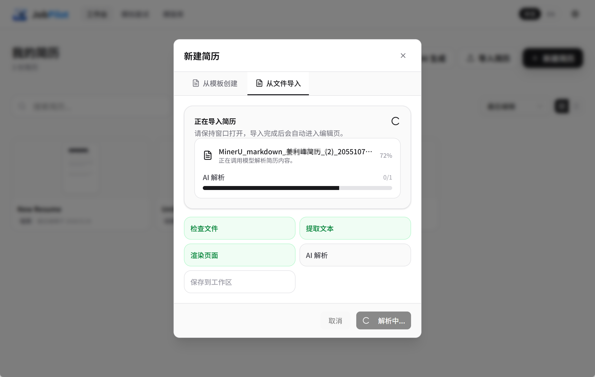
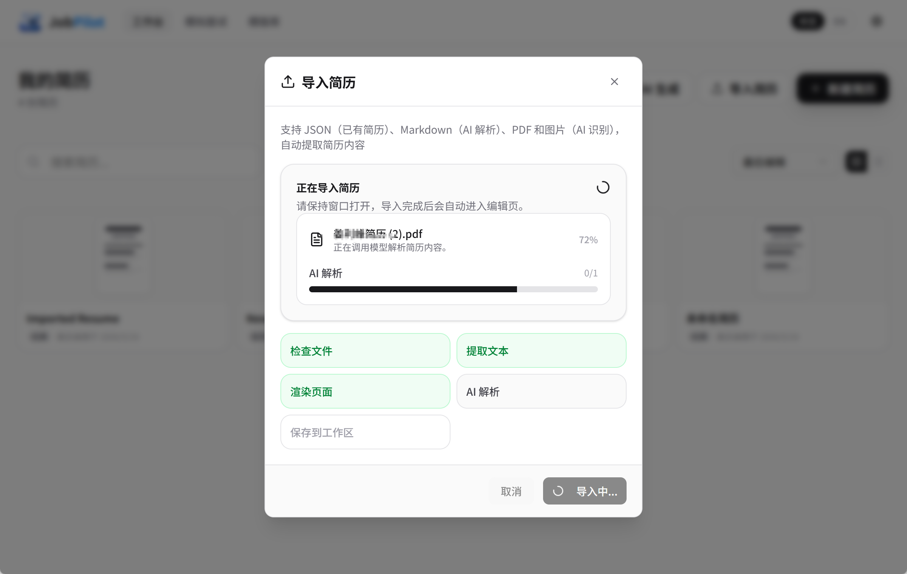
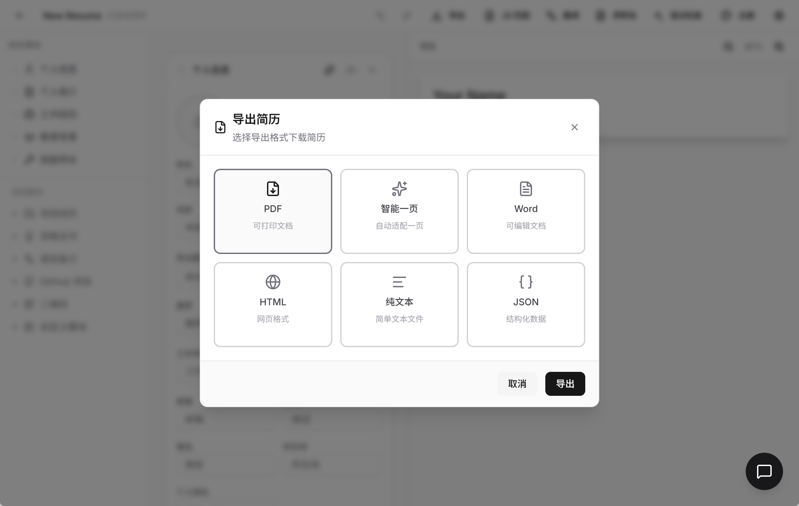
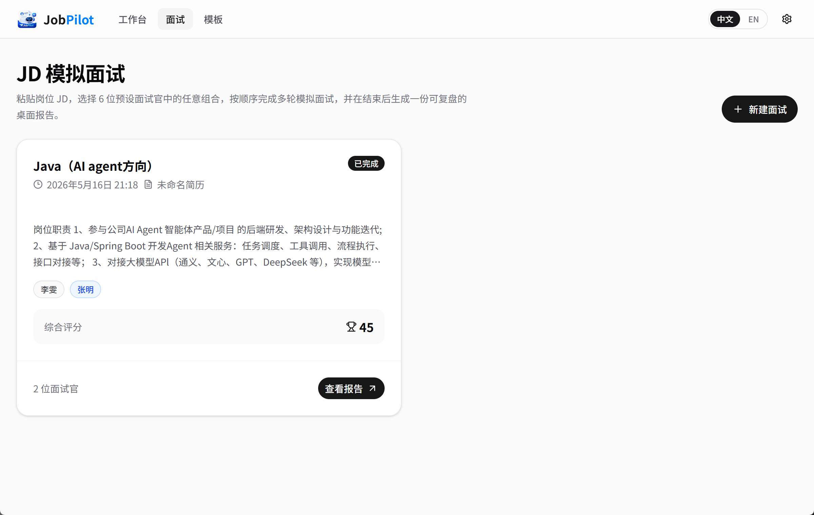
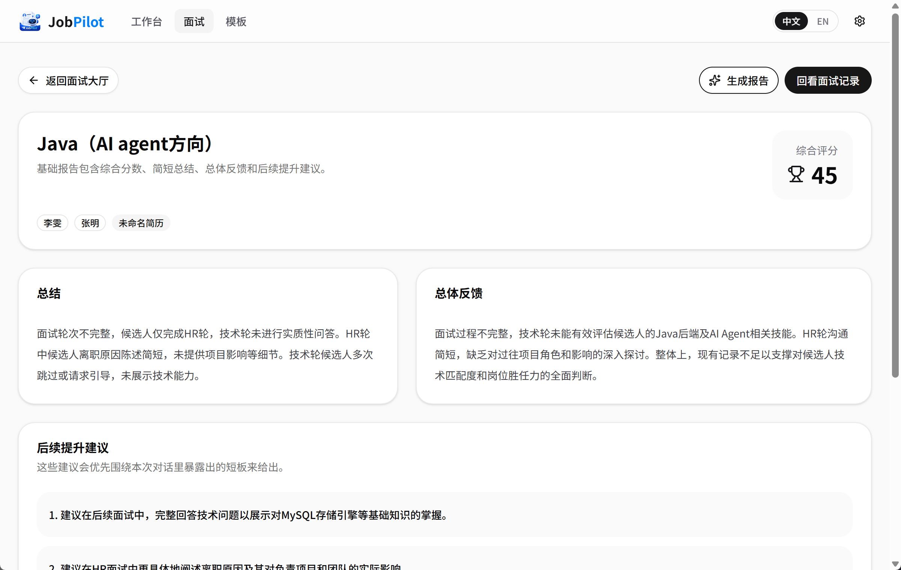

<div align="center">
  

  **Local-First AI Resume Workbench**

  [](LICENSE)
  [](https://tauri.app/)
  [](https://react.dev/)
  [](https://www.typescriptlang.org/)
  [](./desktop)
  [](https://linux.do/)

  [中文文档](./README_CN.md) | English

</div>


---

JobPilot is a **local-first AI job-search desktop app** focused on resume writing, AI-assisted review, JD matching, mock interviews, and private document management. It packages the job-search workflow into a native desktop workspace, so you can import, edit, export, sync, and iterate on your materials without running a server.

## ✨ Key Features

- **Native Desktop Workspace** — Built with Tauri 2, React, TypeScript, and Rust for a lightweight local app experience on Windows and macOS Apple Silicon.
- **AI Resume Review & Editing** — Resume generation, rewriting, grammar checks, JD matching, and AI polishing with per-suggestion application for targeted edits.
- **Anthropic Tool Use Support** — Native Anthropic `tool_use` / `tool_result` flow for resume editing, including precise `replaceResumeText` patches instead of whole-resume rewrites.
- **Multi-Format Import** — Import resumes from JSON, Markdown, PDF, and images. Regular PDFs and scanned documents can be parsed with multimodal AI.
- **Privacy-Aware Export** — Export to PDF, smart one-page PDF, HTML, plain text, Markdown, and JSON, with an optional masking switch for names, phone numbers, emails, companies, schools, and private links.
- **Editor Experience** — Drag-and-drop sections, inline editing, auto-save, Markdown toolbar shortcuts, textarea lists for long content, and 50+ resume templates.
- **Mock Interview & Review** — Create interview sessions from a JD and target role, simulate conversations, delete/restart interview records, and review reports.
- **Encrypted WebDAV Sync** — Back up resumes, settings, and API keys to 123Cloud, Nutstore, Nextcloud, and other WebDAV services with one-click restore.
- **Release & Update Flow** — In-app update checks, version synchronization, Windows/macOS packaging, and release notes generated from the changelog.

## 🚀 Recent Highlights

- **v1.4.0** — Export data masking, Anthropic resume editing tools, precise text replacement, and more stable AI streaming output.
- **v1.3.0** — Redesigned workspace layout, improved editor preview/sidebar, interview deletion/restart, and Anthropic interview streaming.
- **v1.2.2** — Encrypted WebDAV cloud sync with snapshot backup and restore.
- **v1.1.x** — Desktop packaging, multi-format import, enhanced PDF parsing, app updates, template improvements, and macOS support.

## 📋 Changelog

See [CHANGELOG.md](./CHANGELOG.md) for detailed version history.

## 🗺️ Roadmap

Planned features for upcoming releases:

- **Professional Headshot Optimization** — Lightweight LinkedIn/resume avatar cleanup, cropping, and background replacement
- **Resume Version Management** — Compare and restore historical resume versions

> 💡 **Contributions Welcome!** If you have feature suggestions or find bugs, please open an issue on [GitHub Issues](https://github.com/jlifeng/JobPilot/issues) or submit a Pull Request directly.

## 📸 Screenshots

### Workspace & Template Library

| Workspace | Template Library |
|:---------:|:----------------:|
|  |  |

### Resume Editor & AI Assistant

| Edit Resume | AI Assistant |
|:-----------:|:------------:|
|  |  |

### AI Configuration & Import

| AI Config | Parse Markdown | Parse PDF |
|:---------:|:--------------:|:---------:|
|  |  |  |

### Export & Interview

| Multi-Format Export | Mock Interview | Interview Report |
|:-------------------:|:--------------:|:----------------:|
|  |  |  |

## 📥 Installation

1. Go to [GitHub Releases](https://github.com/jlifeng/JobPilot/releases) to download the latest version
2. Download the installer for your platform
3. Double-click to install and launch the app

## 🔧 Build from Source

### Prerequisites

- Node.js 20+
- pnpm 9+
- Rust stable (required for desktop app build)
- Tauri 2 Windows toolchain

### Install Dependencies

```bash
git clone https://github.com/jlifeng/JobPilot.git
cd JobPilot
pnpm install
```

### Development Mode

```bash
# Start Tauri desktop app in development mode
pnpm run dev:tauri

# Start web version in development mode
pnpm run dev:web
```

### Build for Production

```bash
# Build Tauri desktop application
pnpm run build:tauri
```

## 🛠️ Tech Stack

| Category | Technology |
|----------|------------|
| Framework | Next.js 16, React 19 |
| Desktop App | Tauri 2, Rust |
| Language | TypeScript 5 |
| Styling | Tailwind CSS 4 |
| UI Components | shadcn/ui |
| State Management | Zustand |
| AI SDK | Vercel AI SDK |
| Local Data | SQLite, OS Keyring |
| Sync | WebDAV |

## 📄 License

This project is open-sourced under the [Apache License Version 2.0](LICENSE).

## 🙏 Acknowledgments

JobPilot includes work derived from [JadeAI](https://github.com/LingyiChen-AI/JadeAI). Thanks to the original author and the open-source community.

---
